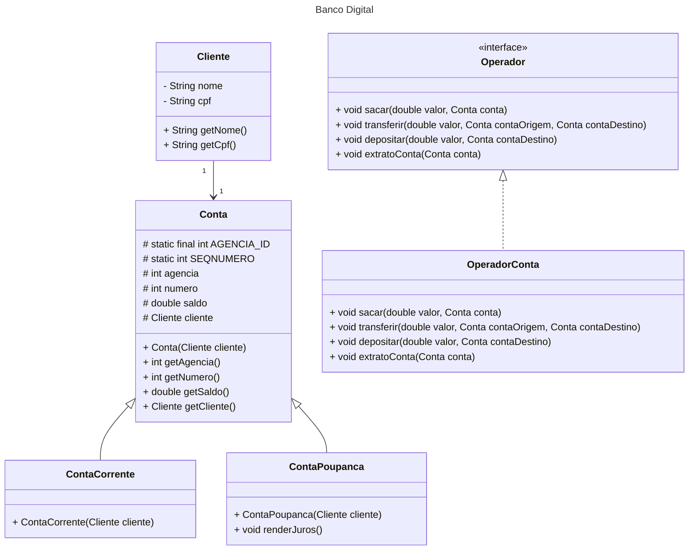

## Modelagem e Digrama

Welcome to the VS Code Java world. Here is a guideline to help you get started to write Java code in Visual Studio Code.

### Diagrama UML (Mermaid)

### Construtor nas Classes Conta Corrente e Conta Poupanca

A classe ContaCorrente e ContaPoupanca inicia com um construtor porque, ao criar um objeto do tipo ContaCorrente ou ContaPoupanca, precisamos definir um cliente titular para a conta. Como ContaCorrente e ContaPoupanca herda de Conta, o construtor chama o construtor da superclasse (Conta) para garantir que todos os atributos essenciais sejam inicializados corretamente.

### O que Aconteceria Sem o Construtor?

Se ContaCorrente ou ContaPoupanca não tivesse um construtor, o compilador tentaria criar um construtor padrão, mas como Conta exige um Cliente, ocorreria um erro de compilação.

Erro: "Constructor Conta() is undefined."

O construtor de ContaCorrente e ContaPoupanca garante que todas as contas criadas tenham um cliente titular e sejam corretamente configuradas através do construtor da classe Conta. Assim, ele evita erros e mantém a consistência do sistema bancário.