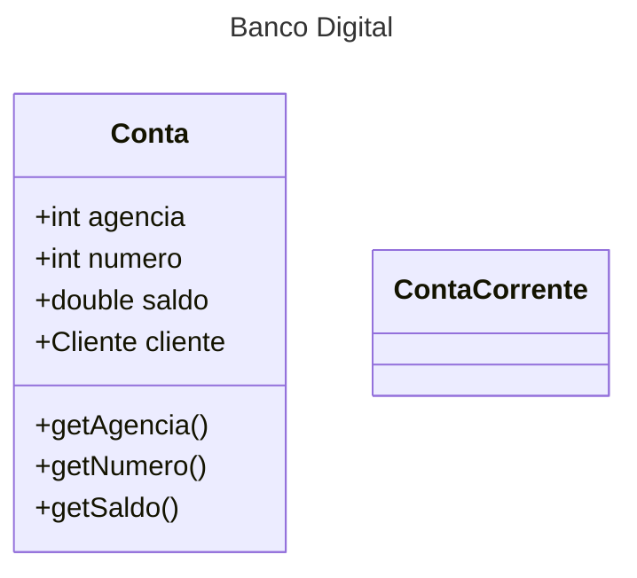

## Modelagem e Digrama

Welcome to the VS Code Java world. Here is a guideline to help you get started to write Java code in Visual Studio Code.

### Diagrama UML (Mermaid)

```mermaid

---
title: Banco Digital
---

classDiagram
    
    Conta: +int agencia
    Conta: +int numero
    Conta: +double saldo
    Conta: +Cliente cliente
    Conta: +getAgencia()
    Conta: +getNumero()
    Conta: +getSaldo()
    

    class ContaCorrente{
     
    }


```