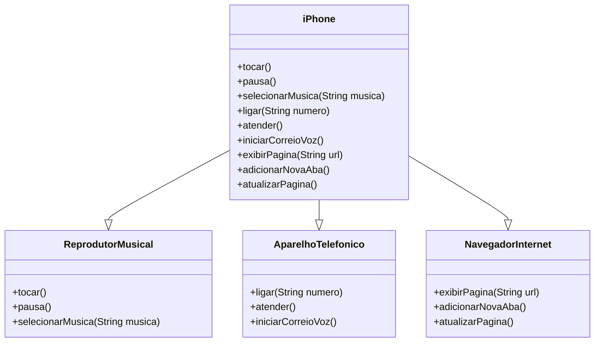

### Modelagem e Diagramação de um Componente iPhone

Modelagem do diagrama e representação em UML do componente iPhone, abrangendo suas funcionalidades como Reprodutor Musical, Aparelho Telefônico e Navegador na Internet

### Diagrama UML (Mermaid)
