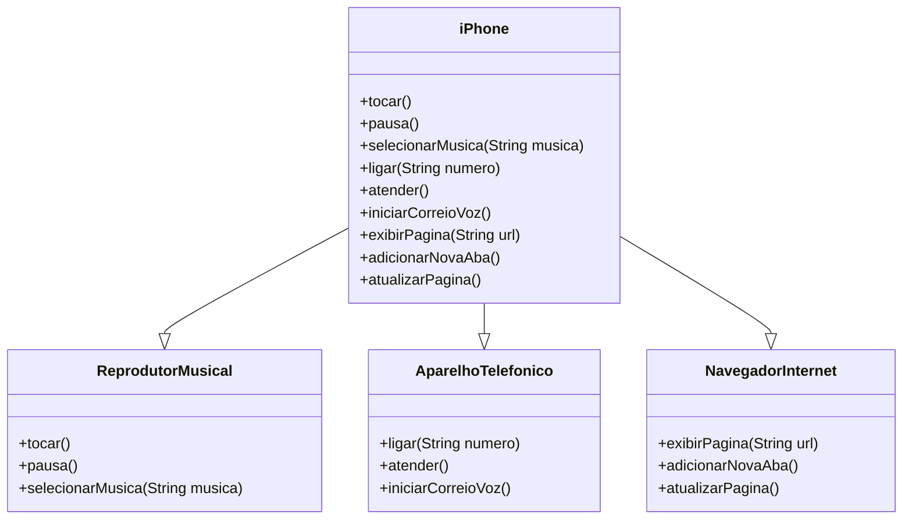

### Modelagem e Diagramação de um Componente iPhone

Modelagem do diagrama e representação em UML do componente iPhone, abrangendo suas funcionalidades como Reprodutor Musical, Aparelho Telefônico e Navegador na Internet

### Diagrama UML (Mermaid)

## Observação

 1. **Código em Mermaid**

classDiagram
    class ReprodutorMusical {
        +tocar()
        +pausa()
        +selecionarMusica(String musica)
    }

    class AparelhoTelefonico {
        +ligar(String numero)
        +atender()
        +iniciarCorreioVoz()
    }

    class NavegadorInternet {
        +exibirPagina(String url)
        +adicionarNovaAba()
        +atualizarPagina()
    }

    class iPhone {
        +tocar()
        +pausa()
        +selecionarMusica(String musica)
        +ligar(String numero)
        +atender()
        +iniciarCorreioVoz()
        +exibirPagina(String url)
        +adicionarNovaAba()
        +atualizarPagina()
    }

    iPhone --|> ReprodutorMusical
    iPhone --|> AparelhoTelefonico
    iPhone --|> NavegadorInternet

2. **Interfaces**

 - ReprodutorMusical, AparelhoTelefonico, e NavegadorInternet representam os comportamentos.

3. **Classe iPhone**

 - Implementa todas as interfaces, agregando suas funcionalidades.

4. **Relações**

 - A relação --|> representa que iPhone implementa as interfaces.

5. **Ferramenta**

 - Mermaid - https://mermaid.js.org/

